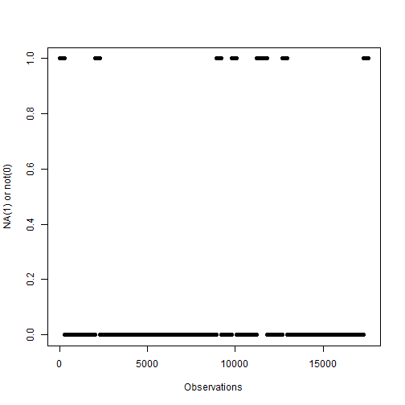

---
<<<<<<< HEAD
title: 'Reproducible Research: Peer Assessment 1'
output: html_document
---
##Introduction
It is now possible to collect a large amount of data about personal movement using activity monitoring devices such as a Fitbit, Nike Fuelband, or Jawbone Up. These type of devices are part of the "quantified self" movement - a group of enthusiasts who take measurements about themselves regularly to improve their health, to find patterns in their behavior, or because they are tech geeks. But these data remain under-utilized both because the raw data are hard to obtain and there is a lack of statistical methods and software for processing and interpreting the data.

This assignment makes use of data from a personal activity monitoring device. This device collects data at 5 minute intervals through out the day. The data consists of two months of data from an anonymous individual collected during the months of October and November, 2012 and include the number of steps taken in 5 minute intervals each day.

##Data
-Dataset: Activity monitoring dataset  

-Variables:  
   1 **steps**: Number of steps taking in a 5-minute interval (missing values are coded as NA)  
   2 **date**: The date on which the measurement was taken in YYYY-MM-DD format  
   3 **interval**: Identifier for the 5-minute interval in which measurement was taken  
   
The dataset is stored in a comma-separated-value (CSV) file and there are a total of 17,568 observations in this dataset.


```r
opts_chunk$set(warning = FALSE, message = FALSE)
```

##Loading and preprocessing the data

```r
library(dplyr)
#load the data
setwd('E:/Coursera/Reproducible research/Week 2/repdata-data-activity/')
```

```
## Error in setwd("E:/Coursera/Reproducible research/Week 2/repdata-data-activity/"): cannot change working directory
```

```r
data <- read.csv('activity.csv')
#check the column names
names(data)
```

```
## [1] "steps"    "date"     "interval"
```

###What is mean total number of steps taken per day?
1 Calculate the total number of steps taken per day


```r
#Group the data by date and sum the steps for each day, ignore the missing value at the moment.
steps_day <- data %>% group_by(date)%>% summarise(sum(steps, na.rm=T))

steps_day <- data.frame(steps_day)
```

2 Plot a histogram of the total number of steps taken each day


```r
hist(steps_day[,2], xlab='Steps Count', main = 'Histogram of steps by day')
```

 

3 Calculate and report the mean and median of the total number of steps taken per day


```r
mean_steps_day <-  mean(steps_day[,2])

median_steps_day <- median(steps_day[,2])

mean_steps_day
```

```
## [1] 9354.23
```

```r
median_steps_day
```

```
## [1] 10395
```

##What is the average daily activity pattern?

1 Make a time series plot (i.e. type = "l") of the 5-minute interval (x-axis) and the average number of steps taken, averaged across all days (y-axis).  
 

```r
#Group data by interval, and average steps per interval across all days and plot
steps_mean_interval <- data %>% group_by(interval)%>% summarise(mean(steps, na.rm=T))

steps_mean_interval <- data.frame(steps_mean_interval)

plot(steps_mean_interval, xaxt ='n', xlab = 'Intervals(min)', ylab = 'Average steps by interval', main = 'Average steps taken by interval')

axis(side = 1,  at = seq(0, 2355, 100), label = T, las =2)
```

 

2 Which 5-minute interval, on average across all the days in the dataset, contains the maximum number of steps?


```r
max_step_interval <- max(steps_mean_interval[,2])

steps_max_interval <- steps_mean_interval[steps_mean_interval[,2]==max_step_interval, 1]

steps_max_interval
```

```
## [1] 835
```

##Inputing missing values
Note that there are a number of days/intervals where there are missing values (coded as NA). The presence of missing days may introduce bias into some calculations or summaries of the data.

1 Calculate and report the total number of missing values in the dataset (i.e. the total number of rows with NAs)

```r
na_data <- length(data[is.na(data$steps),1])

na_data
```

```
## [1] 2304
```

2 Devise a strategy for filling in all of the missing values in the dataset. 
  My strategy is to fill each block of missing values with the average steps of interval obtained in last question.
    

```r
#Check the distribution of the NAs
plot(is.na(data$steps), xlab = "Observations", ylab = "NA(1) or not(0)")
```

 

```
3 Create a new dataset that is equal to the original dataset but with the missing data filled in.

```r
fillings <- steps_mean_interval[, 2]

Fillings <- rep(fillings, na_data/length(fillings))

fill_data <- mutate(data, steps=replace(steps, is.na(steps), Fillings))

steps_fill <- fill_data %>% group_by(date)%>% summarise(sum(steps))

steps_fill_day <- data.frame(steps_fill)

head(steps_fill_day)
```

```
##         date sum.steps.
## 1 2012-10-01   10766.19
## 2 2012-10-02     126.00
## 3 2012-10-03   11352.00
## 4 2012-10-04   12116.00
## 5 2012-10-05   13294.00
## 6 2012-10-06   15420.00
```

4 Make a histogram of the total number of steps taken each day and Calculate and report the mean and median total number of steps taken per day. Do these values differ from the estimates from the first part of the assignment? What is the impact of imputing missing data on the estimates of the total daily number of steps?


```r
hist(steps_fill_day[,2], xlab = 'Steps Count', main = 'Histogram of steps by day')
```

 

```r
mean_steps_fill <-  mean(steps_fill_day[,2])

median_steps_fill <- median(steps_fill_day[,2])

mean_steps_fill
```

```
## [1] 10766.19
```

```r
median_steps_fill
```

```
## [1] 10766.19
```

```r
#Plot a box plot to show the difference of original and filled data

boxplot(steps_fill_day[,2], steps_day[,2], names = c('Filled data', 'Original data'))
```

 

##Are there differences in activity patterns between weekdays and weekends?

1 Create a new factor variable in the dataset with two levels - "weekday" and "weekend" indicating whether a given date is a weekday or weekend day.

```r
fill_data$date <- as.Date(fill_data$date)

#Add weekday variables to indicate on what day the steps was measured
fill_data$weekdays <- weekdays(fill_data$date)

#Add variable to classify the days into "weekdays" and "weekends"
fill_data <- fill_data %>% mutate(Weekdays_end = ifelse(weekdays == 'Saturday'| weekdays =='Sunday', "Weekend", "Weekday"))
```

2 Make a panel plot containing a time series plot (i.e. type = "l") of the 5-minute interval (x-axis) and the average number of steps taken, averaged across all weekday days or weekend days (y-axis). See the README file in the GitHub repository to see an example of what this plot should look like using simulated data.

```r
#Group and summarise the data by averaging steps of interval across either weekends or weekdays
ave_week <- fill_data %>% group_by(interval,Weekdays_end) %>% summarise(mean(steps)) %>% mutate(Weekdays_end = as.factor(Weekdays_end))

ave_week <- data.frame(ave_week)

#Pannel plot the above data
library(ggplot2)

qplot(interval,mean.steps., data = ave_week, facets = Weekdays_end ~., geom = "line", xlab = "Interval", ylab = "Number of steps")
```

 


